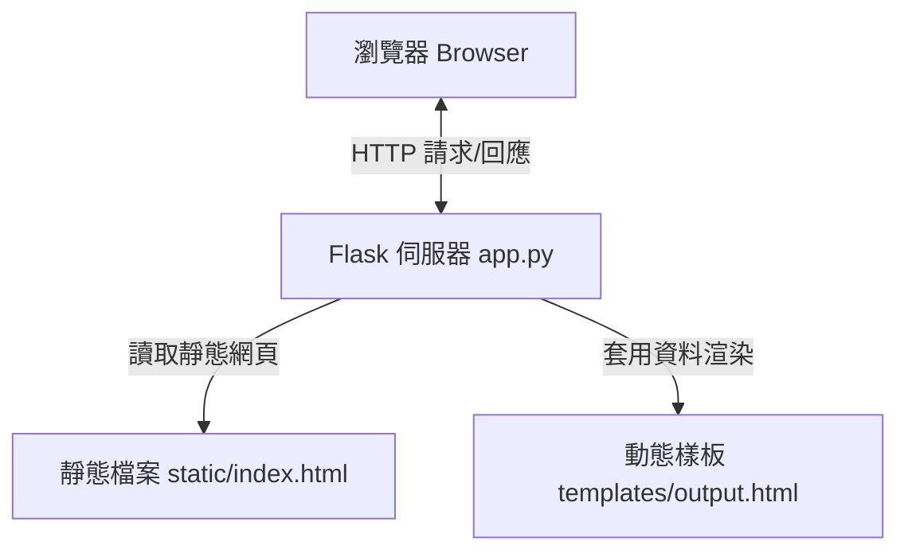
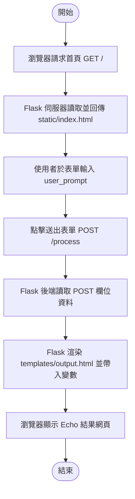
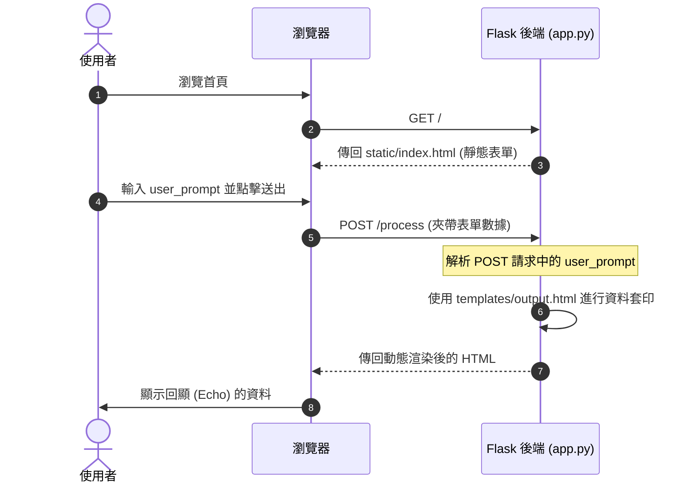

# Flask Form 傳輸與處理範例說明文件

本專案是一個簡單的 Python Flask 範例，展示了如何將前端 `<form>` 表單的資料發送到後端進行處理，並將結果以動態網頁（Jinja2 樣板）的形式 Echo 回瀏覽器。

---

## 1. 系統架構與流程圖

### 1.1 系統架構圖 (System Architecture)
本系統主要由瀏覽器（客戶端）、Flask 伺服器以及靜態與動態資源所組成：



### 1.2 系統流程圖 (Workflow Flowchart)
下圖展示了使用者從進入首頁、輸入資料到取得 Echo 結果的完整流程：



### 1.3 循序圖 (Sequence Diagram)
詳細的前後端互動時序如下：



---

## 2. 匯入模組 (Import Modules) 說明與操作說明

### 2.1 匯入模組說明
在本專案的 [app.py](file:///home/dengkai/projects/nkust-ai-application-practical-course-01/115-07-08/example/proj005/app.py) 中，我們使用了 `flask` 套件中的三個核心類別/函式：

```python
from flask import Flask, request, render_template
```

* **`Flask`**: Flask 框架的核心類別，用於實例化 Web 應用程式物件 (`app = Flask(__name__)`) 並設定路由。
* **`request`**: Flask 全域請求對象，用於獲取當前 HTTP 請求的相關資訊。在本專案中，我們使用 `request.form.get('user_prompt')` 來取得以 `POST` 方式送來的表單欄位。
* **`render_template`**: 用於載入並渲染 HTML 樣板檔案。它會自動尋找專案根目錄下 `templates/` 資料夾中的 HTML 檔案，並支持將 Python 變數傳入，與 Jinja2 樣板引擎結合生成動態網頁。

### 2.2 操作與執行說明
本專案已配置使用現有的虛擬環境（venv）進行執行。

#### 步驟 1: 進入專案資料夾
```bash
cd /home/dengkai/projects/nkust-ai-application-practical-course-01/115-07-08/example/proj005
```

#### 步驟 2: 啟動 Flask 服務
專案中已建立 `run.sh` 啟動腳本，該腳本會自動使用正確的 venv 路徑來啟動伺服器：
```bash
./run.sh
```

#### 步驟 3: 網頁操作
1. 開啟瀏覽器並連線至：`http://127.0.0.1:5000`。
2. 頁面將呈現一個簡單的輸入框，提示您輸入「Prompt」。
3. 輸入任意文字後，點擊「送出」。
4. 網頁會跳轉至 `/process` 並以動態網頁形式顯示您剛才輸入的內容。

---

## 3. API Key 匯入與設定說明

雖然目前的 Echo 範例是一個純本地的資料處理過程，不需要調用外部服務，但若未來需要擴充此專案（例如：將收到的 `user_prompt` 送至 Gemini、OpenAI 等大語言模型 API 進行處理），請遵循以下標準安全規範來設定與匯入 API Key。

### 3.1 為什麼要安全匯入 API Key？
**絕對不要**將 API Key 直接硬編碼（Hardcode）在 `app.py` 中，這會導致金鑰意外洩露至 Git 版本控制系統中。推薦做法是使用環境變數（Environment Variables）來讀取。

### 3.2 設定步驟說明

#### 步驟 1: 安裝 dotenv 套件
在您的虛擬環境中安裝 `python-dotenv` 套件：
```bash
/home/dengkai/projects/nkust-ai-application-practical-course-01/venv/bin/pip install python-dotenv
```

#### 步驟 2: 建立環境變數設定檔 `.env`
在專案根目錄（與 `app.py` 同一層級）建立一個名為 `.env` 的檔案，寫入您的金鑰資訊（例如 Gemini API）：
```env
# 外部 API 金鑰設定檔
GEMINI_API_KEY="your_api_key_here"
```
> **注意**：必須將 `.env` 檔案加入至 `.gitignore` 中，防止上傳至 Git 倉庫。

#### 步驟 3: 在 Python 中讀取並匯入 API Key
在您的 `app.py` 最上方加入以下程式碼來載入並讀取環境變數：

```python
import os
from dotenv import load_dotenv

# 載入 .env 檔案中的環境變數
load_dotenv()

# 讀取 API Key
api_key = os.getenv("GEMINI_API_KEY")

if not api_key:
    print("警告：未偵測到 GEMINI_API_KEY 環境變數，請確認 .env 檔案設定。")
else:
    print("API Key 匯入成功！")
```
