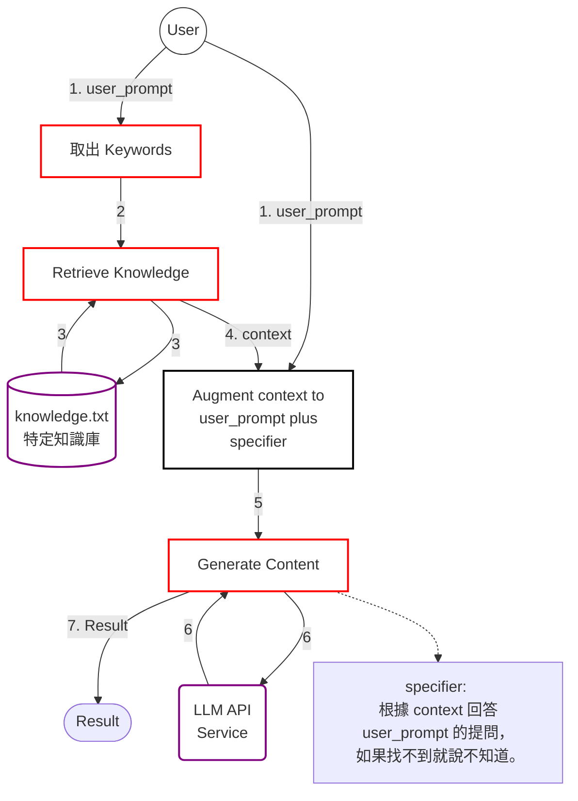
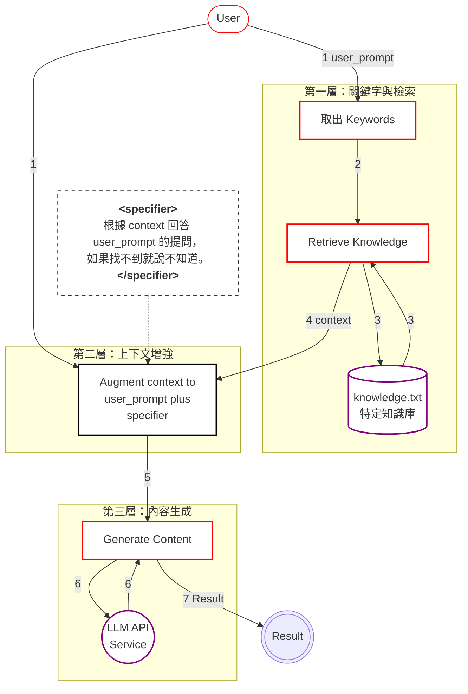
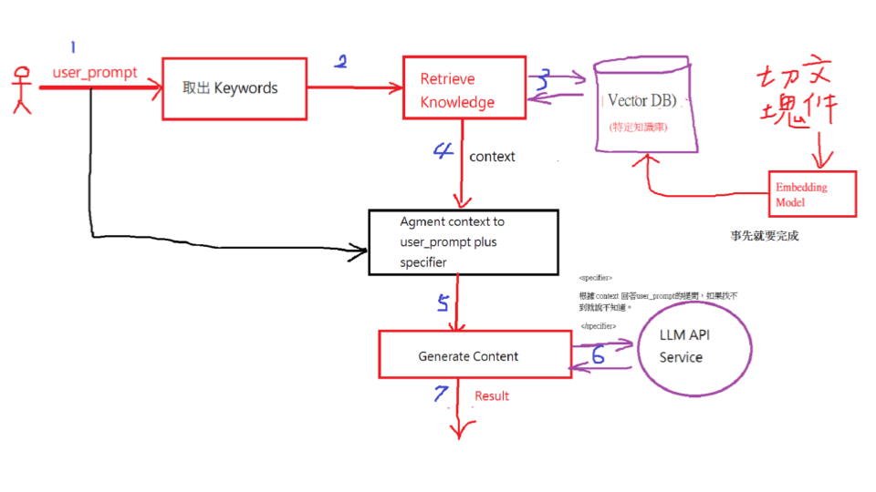
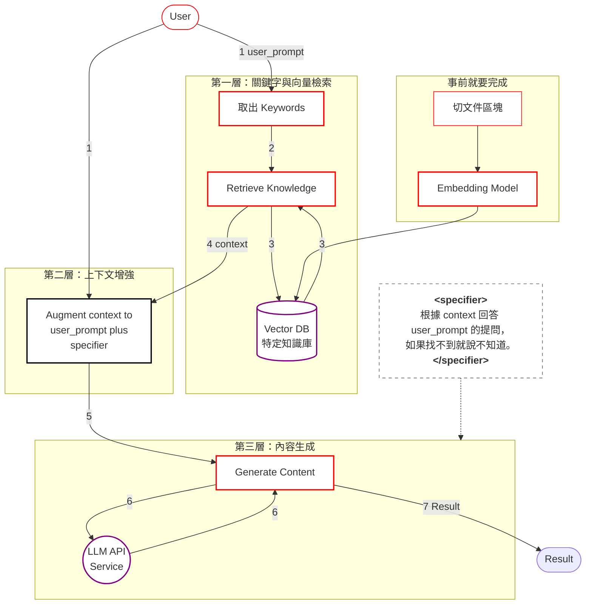
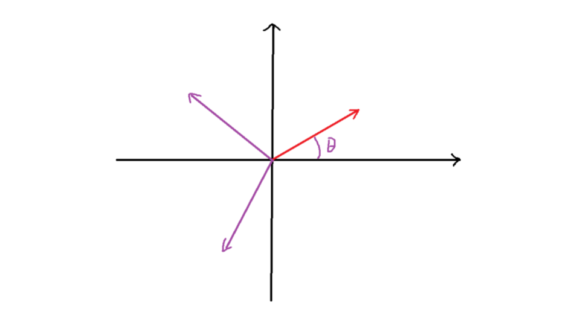
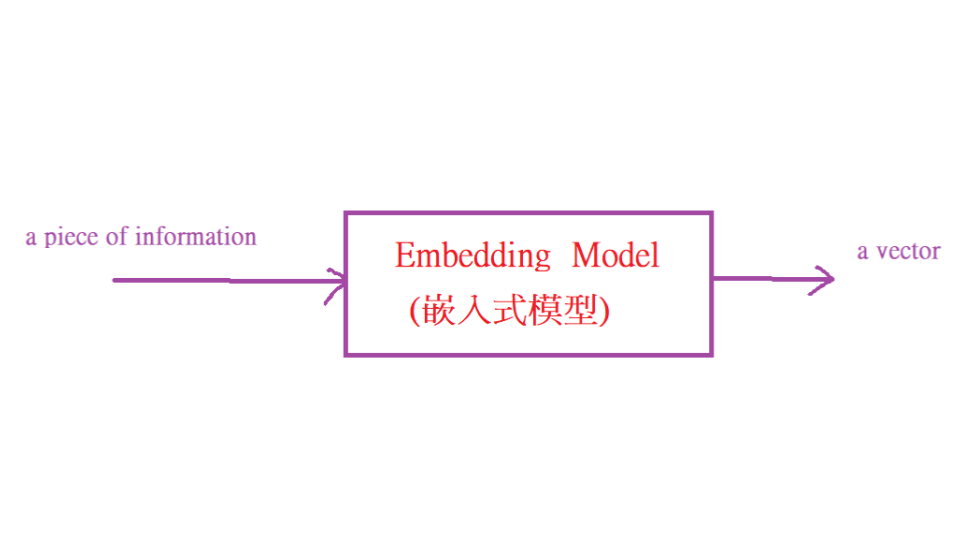
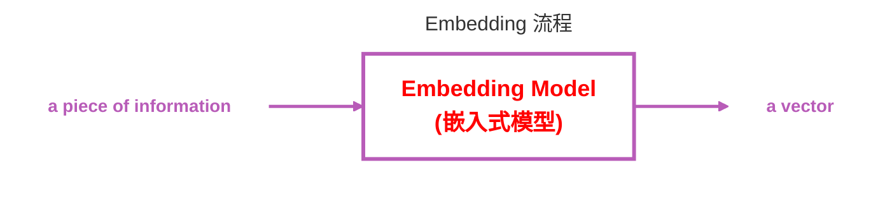
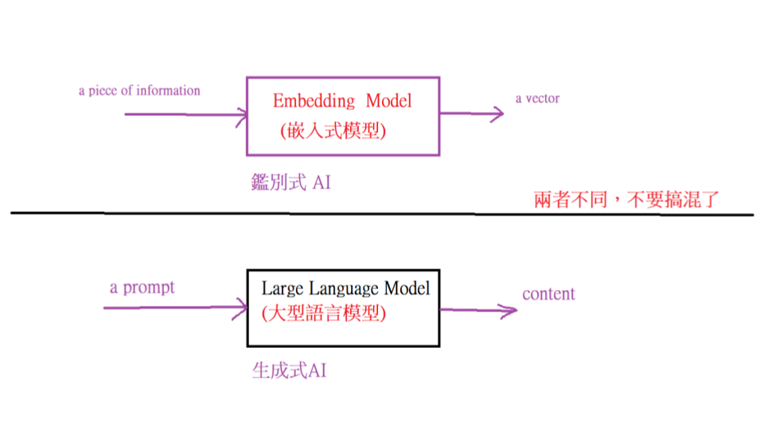

```mermaid
graph TB
    %% 樣式定義 (紫色、紅色、黑色與警告文字)
    classDef plainTextStyle fill:none,stroke:none,color:#b85cb8,font-weight:bold,font-size:14px;
    classDef warningTextStyle fill:none,stroke:none,color:#e53e3e,font-weight:bold,font-size:16px;
    
    classDef embedModelStyle fill:#fff,stroke:#b85cb8,stroke-width:3px,color:#ff0000,font-weight:bold,font-size:16px;
    classDef llmModelStyle fill:#fff,stroke:#000000,stroke-width:3px,color:#000000,font-weight:bold,font-size:16px;
    
    classDef subTitleStyle fill:none,stroke:none,color:#b85cb8,font-size:15px,font-weight:bold;
    classDef lineStyle fill:#000,stroke:#000,stroke-width:2px;

    %% --- 上半部：鑑別式 AI ---
    subgraph UpperArea [ ]
        direction LR
        Input1[a piece of information]:::plainTextStyle
        Model1["Embedding Model<br><span style='color:#ff0000;'>(嵌入式模型)</span>"]:::embedModelStyle
        Vector1[a vector]:::plainTextStyle
        
        Input1 -- " " --> Model1
        Model1 -- " " --> Vector1
    end
    style UpperArea fill:none,stroke:none;

    %% 上半部備註與警告
    subgraph MiddleLabels [ ]
        direction LR
        Label1[鑑別式 AI]:::subTitleStyle
        LabelWarning[兩者不同，不要搞混了]:::warningTextStyle
    end
    style MiddleLabels fill:none,stroke:none;

    %% --- 分割線 ---
    subgraph DividerArea [ ]
        direction LR
        DividerLine[==========================================================================================]:::lineStyle
    end
    style DividerArea fill:none,stroke:none;

    %% --- 下半部：生成式 AI ---
    subgraph LowerArea [ ]
        direction LR
        Input2[a prompt]:::plainTextStyle
        Model2["Large Language Model<br><span style='color:#ff0000;'>(大型語言模型)</span>"]:::llmModelStyle
        Vector2[content]:::plainTextStyle
        
        Input2 -- " " --> Model2
        Model2 -- " " --> Vector2
    end
    style LowerArea fill:none,stroke:none;

    %% 下半部備註
    subgraph BottomLabels [ ]
        direction LR
        Label2[生成式AI]:::subTitleStyle
    end
    style BottomLabels fill:none,stroke:none;

    %% 垂直佈局結構控制 (確保上下層與分割線的順序)
    UpperArea --> MiddleLabels
    MiddleLabels --> DividerArea
    DividerArea --> LowerArea
    LowerArea --> BottomLabels

    %% 調整箭頭連線顏色 (紫色)
    linkStyle 0 stroke:#b85cb8,stroke-width:2.5px;
    linkStyle 1 stroke:#b85cb8,stroke-width:2.5px;
    linkStyle 2 stroke:#b85cb8,stroke-width:2.5px;
    linkStyle 3 stroke:#b85cb8,stroke-width:2.5px;
    
    %% 隱藏用於控制上下順序的輔助連線
    linkStyle 4 stroke:none,stroke-width:0px;
    linkStyle 5 stroke:none,stroke-width:0px;
    linkStyle 6 stroke:none,stroke-width:0px;
    linkStyle 7 stroke:none,stroke-width:0px;
```

### Prompt Engineering (提示詞工程)，因為與 ```LLM``` 溝通是要講方法的。
 - ```specifer``` 是規範之意，限定 ```LLM``` 的內容生成範圍
 - ```<specifier>``` 根據 ```context``` 回答 ```user_prompt``` 的提問，如果找不到就說不知道。 ```</specifier>```
 - ```<context>```xxxxxxxxxxxxxxxx```</context>```
 - ```<user_prompt>```?????????????????```</user_prompt>```
### 在 ```Python```，要把這些打包成字串，儲存在 ```user_prompt``` 變數內
```python
user_prompt= "<user_prompt>?????????????????</user_prompt>"
user_prompt=user_prompt + "<context>xxxxxxxxxxxxxxxx</context>"
user_prompt=user_prompt+ "<specifier>根據 context 回答user_prompt的提問，如果找不到就說不知道。 </specifier>"
```
 - 然後發出 ```Request``` 到 ```LLM API Service```，它就會按照 ```specifier``` 的規範生成內容
 - ```<context>```的內容，我們要寫程式從特定資料庫取出後放進去。
### ```Application``` 有 ```2``` 種：
 1. **獨立執行**：```C:>python.exe  keyWordSearch.py```，重頭執行完就結束. 可使用 ```IDLE```、```CLI```、```Colab```
 2. **Web**：```C:>python.exe app.py``` ，一直處於執行中，```service```，等待連線。只能在 ```CLI```

### ```System Analysis & Design``` 
 - (1) 先有架構再擴充不同的單元與模組，例如 ```Python Flask Web``` 架構。
 - (2) 單元或模組都可以用 ```AI``` 生成。
 - (3) 完成 ```Testing(測試)```。
 - (4) 整合到架構內。

### File-Based RAG Application

 - **樣式（一）、初版 PNG 轉換 Mermaid 格式**
   - **Prompt 描述**
    ```txt
    請將「圖片 architecture.png」轉換為 mermaid 格式的系統架構圖。
    ```
   - **Mermaid 格式**

 - **樣式（二）、PNG 轉換 Mermaid 格式，加入 subgraph 的描述**
   - **Prompt 描述**
    ```txt
    請將「圖片 architecture.png」轉換為 mermaid 格式的系統架構圖，並以 subgraph 方式保留「圖片 architecture.png」layout 的樣式。
    ```
   - **Mermaid 格式**


### ```context="。".join(ai_results)```
 - ```join()``` 是內建函式
 - ```ai_results``` 是陣列 ```(list)```，元素是字串
 - 取出每個元素，加上。後串成一個字串
### 這是向 ```LLM API``` 發出 ```POST```, ```Request```
```python
response = requests.post(url, headers=headers, json=data)
result=response.json()
```
 - ```result``` 是 ``LLM API`` 傳回的結果，是 ```JSON``` 格式：
```json
{'candidates': [{'content': {'parts': [{'text': '根據您提供的 context，AI（Artificial Intelligent）的說明如下：\n\n1. 主要分為**鑑別式AI**與**生成式AI**。\n2. **資料探勘**有時也被稱為AI。\n3. **基因演算法這一類的最佳解搜尋**也被稱為AI。', 'thoughtSignature': 'EsgNCsUNARFNMg85zqOT6sormNieuNnLFU8+1YJ9YOpWCyTIk='}], 'role': 'model'}, 'finishReason': 'STOP', 'index': 0}], 'usageMetadata': {'promptTokenCount': 71, 'candidatesTokenCount': 63, 'totalTokenCount': 544, 'promptTokensDetails': [{'modality': 'TEXT', 'tokenCount': 71}], 'thoughtsTokenCount': 410, 'serviceTier': 'standard'}, 'modelVersion': 'gemini-3.5-flash', 'responseId': '-kRYaq7lLOf-1e8P1tzfgQE'}
```
 - 如何只取出 ```text`` 欄位 ```(key)`` 的內容 ```(value)```
```python
# json 取值方式（ㄧ）
result['candidates'][0]['content']['parts'][0]['text']

# json 取值方式（二）：function get
(result.json()).get('candidates', [{}])[0]
               .get('content', {})
               .get('parts', [{}])[0]
               .get('text', '找不到內容')
```
 - json 值
```json
[{'content': {'parts': [{'text': '根據您提供的 context，AI（Artificial Intelligent）的說明如下：\n\n1. 主要分為**鑑別式AI**與**生成式AI**。\n2. **資料探勘**有時也被稱為AI。\n3. **基因演算法這一類的最佳解搜尋**也被稱為AI。', 'thoughtSignature': 'EsgNCsUNARFNMg85zqOT6sormNieuNnLFU8+1YJ9YOpWCyTIk='}], 'role': 'model'}, 'finishReason': 'STOP', 'index': 0}]
```
### 編寫一個 ```python``` 函式，給定 ```Markdown``` 格式的字串，可以將該 ```Markdown``` 轉成 ```HTML``` 的字串，使用 ``` Markdown``` 轉成 ```HTML``` 的模組 ```Module```。
 - ```markdown``` 字串 
   根據您提供的 ```context```，```AI（Artificial Intelligent）```的說明如下：
   1. 主要分為**鑑別式 ```AI```**與**生成式 ```AI```**。
   2. **資料探勘**有時也被稱為 ```AI```。
   3. **基因演算法這一類的最佳解搜尋**也被稱為 ```AI```。
 - ```html``` 字串
```html
<p>根據context，關於「AI」（Artificial Intelligent）的資訊如下：</p> <ol> <li>主要分為<strong>鑑別式AI</strong>與<strong>生成式AI</strong>。</li> <li><strong>資料探勘</strong>有時也被稱為AI。</li> <li><strong>基因演算法</strong>這一類的最佳解搜尋也被稱為AI。</li> </ol>
```
 - ```Browsrer``` 看到的是
```html
&lt;p&gt;根據context，關於「AI」（Artificial Intelligent）的資訊如下：&lt;/p&gt;
&lt;ol&gt;
&lt;li&gt;主要分為&lt;strong&gt;鑑別式AI&lt;/strong&gt;與&lt;strong&gt;生成式AI&lt;/strong&gt;。&lt;/li&gt;
&lt;li&gt;&lt;strong&gt;資料探勘&lt;/strong&gt;有時也被稱為AI。&lt;/li&gt;
&lt;li&gt;&lt;strong&gt;基因演算法&lt;/strong&gt;這一類的最佳解搜尋也被稱為AI。&lt;/li&gt;
&lt;/ol&gt;
```
 - - 其中 ```&lt;``` 代表是 ```<``` 符號。 
 - ```Python``` 程式內容：
```python
result=response.json()
# 只取出 text 欄位(key)的內容(value)
outstr=result['candidates'][0]['content']['parts'][0]['text']
outstr=markdown_to_html(outstr)
# 將user_prompt與result 傳給動態網頁 output.html再呈現給User
return render_template("output.html", user_prompt=user_prompt,result=outstr)
```
---
 - ```outstr``` 是 ```HTM``` L字串了，透過 ```output.html``` 傳給 ```Browser```，```html tag``` 沒有效果?
 - ```Jinja2``` 為了防止 ```XSS``` 的攻擊，```output.html``` 的 ```{{ result }}``` ，若 ```result``` 是 ```HTML``` 字串，會將 ```tag``` 的 ```>``` 以 ```&gt;``` 表示，```<``` 以 ```&lt;```  然後再傳給 ```Browser```，因此 ```Browser``` 不會啟動 ```html tag``` 的解讀，只是隨手再將 ```&gt;``` 換成  ```>``` ， ```&lt;``` 換成 ```<```。
 - ```output.html``` 的 ```{{ result }}``` 換成 ```{{ result | safe }}```。 
---

### 特定知識庫可以存在File、VB DB、關聯式DB、....
### Vector DB-Based RAG

 - **樣式（一）、PNG 轉換 Mermaid 格式，加入 subgraph 的描述**
   - **Prompt 描述**
    ```txt
    請將「圖片 vector-db-architecture.png」轉換為 mermaid 格式的系統架構圖，並以 subgraph 方式保留「圖片 vector-db-architecture.png」layout 的樣式。
    ```
   - **Mermaid 格式**


---
### 何謂向量(Vector)?
 - 可標示在一個座標系統上，有方向有大小。平面座標系統只有2個維度。


 - **樣式（一）、PNG 轉換 Mermaid 格式，加入 subgraph 的描述**
   - **Prompt 描述**
    ```txt
    請將「圖片 2d-vector.png」以「Markdown 內嵌 SVG 代碼」方式轉換。
    ```
   - **Markdown 內嵌 SVG 代碼**
   

---

 - 研究者累積了 30 年的 NLP(Natural Language Processing) 研究成果，找到一種將一段訊息 (a piece of information) 轉換成語意空間 (semaentic space) 的一個點(向量)的方法。


 - **樣式（一）、初版 PNG 轉換 Mermaid 格式**
   - **Prompt 描述**
    ```txt
    請將「圖片 ebedding-flowchart.png」轉換為 mermaid 格式的系統流程圖，並以 subgraph 方式保留「圖片 ebedding-flowchart.png」layout 的樣式。
    ```
   - **Mermaid 格式**


---

 - 這裡的向量，維度可以高達 3000，起碼是 300。
 - 常見 Embedding Model (目前最常用的是使用 類神經網路模型, Artificail Neural Network)
   - OpenAI text-embedding-3-small
   - OpenAI text-embedding-3-large
   - Google Gemini Embedding
   - Cohere Embed
   - BAAI bge-large
   - BAAI bge-m3
   - e5-base-v2
   - e5-large-v2
   - all-MiniLM-L6-v2（Sentence Transformers）
   - multilingual-e5-large（支援多語言）
 - 其中：
   - OpenAI text-embedding-3-small：成本低、速度快，適合一般語意搜尋與 RAG。
   - OpenAI text-embedding-3-large：精度更高，適合大型知識庫、企業級搜尋與複雜檢索。
   - BAAI bge-m3：支援多語言（包含繁體中文），在多語言檢索任務中表現優異。
   - multilingual-e5-large：也是多語言模型，適合跨語言搜尋與文件匹配。

---



 - **樣式（一）、初版 PNG 轉換 Mermaid 格式**
   - **Prompt 描述**
    ```txt
    請將「圖片 ebedding-llm-flowchart.png」轉換為 mermaid 格式的系統流程圖，並以 subgraph 方式保留「圖片 ebedding-llm-flowchart.png」layout 的樣式。
    ```
   - **Mermaid 格式**


---

### 練習（一）
 - **Prompt 描述**
 ```prompt
 編寫一個Python程式，可以將一段文字轉成向量，使用all-MiniLM-L6-v2 嵌入式模型。提供文字輸入欄位可以變化輸入內容。
 ```
 - **生成之程式碼**
 ```python
from sentence_transformers import SentenceTransformer

def text_to_embedding():
    # 1. 載入 all-MiniLM-L6-v2 模型
    # 第一次執行時，程式會自動從 Hugging Face 下載模型權重（約 80MB）
    print("正在載入 all-MiniLM-L6-v2 模型，請稍候...")
    model = SentenceTransformer('all-MiniLM-L6-v2')
    print("模型載入完成！\n")

    # 2. 提供文字輸入欄位，讓使用者可以自由變化輸入內容
    user_input = input("請輸入想要轉換成向量的文字：")
    
    if not user_input.strip():
        print("輸入內容不能為空！")
        return

    # 3. 將文字轉換為向量 (Embedding)
    print("\n正在計算向量...")
    embedding = model.encode(user_input)

    # 4. 輸出結果
    print("\n--- 轉換結果 ---")
    print(f"輸入的文字: \"{user_input}\"")
    print(f"向量總維度 (Dimensions): {len(embedding)}")
    
    # 取出前 10 個元素並格式化輸出
    first_10_elements = embedding[:10]
    print("向量的前 10 個元素為:")
    print("[ " + ", ".join([f"{val:.16f}" for val in first_10_elements]) + ", ... ]")

if __name__ == "__main__":
    text_to_embedding()
 ```
 - **程式執行結果**
```bash
正在載入 all-MiniLM-L6-v2 模型，請稍候...
Warning: You are sending unauthenticated requests to the HF Hub. Please set a HF_TOKEN to enable higher rate limits and faster downloads.
Loading weights: 100%|████████████████████████████████████████████████████████████████████████████████| 103/103 [00:00<00:00, 1853.83it/s]
模型載入完成！

請輸入想要轉換成向量的文字：cat

正在計算向量...

--- 轉換結果 ---
輸入的文字: "cat"
向量總維度 (Dimensions): 384
向量的前 10 個元素為:
[ 0.0373303517699242, 0.0511617586016655, -0.0003060754970647, 0.0602098666131496, -0.1174943968653679, -0.0142301004379988, 0.1057761758565903, 0.0267862137407064, 0.0263377539813519, -0.0257008280605078, ... ]
```
 - **練習說明**：
   - print出向量的前10個元素。
     輸入文字：cat
     Embedding 維度：384
     Embedding 前10個元素:
      - 0: 0.03733031079173088
      - 1: 0.05116179585456848
      - 2: -0.00030603870982304215
      - 3: 0.06020984426140785
      - 4: -0.11749442666769028
      - 5: -0.014230088330805302
      - 6: 0.10577621310949326
      - 7: 0.026786241680383682
      - 8: 0.026337794959545135
      - 9: -0.02570078708231449
 - 兩個語意接近的一段話，轉成向量後，這兩個向量應該很接近。
   - 如何 measure distance? 使用角度，也就是向量夾角。
   - 夾角越小，cosine值越大。 cos(0)=1.0。
   - cosine similarity

---

### 練習（二）
 - **Prompt 描述**
 ```prompt
 編寫一個Python程式，可以輸入二段文字，分別轉成向量，並算出Cosine Similarity，使用all-MiniLM-L6-v2 嵌入式模型。提供文字輸入欄位可以迴圈式輸入內容，兩兩比較。
 ```
 - **生成之程式碼**
 ```python
from sentence_transformers import SentenceTransformer, util

def compare_sentences_loop():
    # 1. 載入 all-MiniLM-L6-v2 模型
    print("正在載入 all-MiniLM-L6-v2 模型，請稍候...")
    model = SentenceTransformer('all-MiniLM-L6-v2')
    print("模型載入完成！開始進行語意相似度比較。")
    print("（提示：在任何輸入欄位輸入 'q' 即可退出程式）\n")

    # 2. 進入互動式迴圈
    while True:
        print("-" * 50)
        # 輸入第一段文字
        text1 = input("請輸入第一段文字: ").strip()
        if text1.lower() == 'q':
            print("程式已結束。")
            break
        if not text1:
            print("❌ 輸入不能為空，請重新輸入。")
            continue

        # 輸入第二段文字
        text2 = input("請輸入第二段文字: ").strip()
        if text2.lower() == 'q':
            print("程式已結束。")
            break
        if not text2:
            print("❌ 輸入不能為空，請重新輸入。")
            continue

        # 3. 將兩段文字分別轉成向量
        embedding1 = model.encode(text1, convert_to_tensor=True)
        embedding2 = model.encode(text2, convert_to_tensor=True)

        # 4. 計算 Cosine Similarity (餘弦相似度)
        # util.cos_sim 會回傳一個 PyTorch Tensor 二維矩陣，我們取出數值即可
        similarity = util.cos_sim(embedding1, embedding2).item()

        # 5. 輸出結果
        print(f"\n👉 相似度分析結果:")
        print(f"   [文字 A]: {text1}")
        print(f"   [文字 B]: {text2}")
        print(f"   ➡️ 餘弦相似度 (Cosine Similarity): {similarity:.8f}")
        
        # 給予直觀的語意判斷提示
        if similarity > 0.8:
            print("   💡 評語: 這兩句話語意極度相似！")
        elif similarity > 0.5:
            print("   💡 評語: 這兩句話有高度相關性。")
        elif similarity > 0.2:
            print("   💡 評語: 這兩句話有些微關聯。")
        else:
            print("   💡 評語: 這兩句話幾乎沒有關聯。")
        print("-" * 50 + "\n")

if __name__ == "__main__":
    # 請確保檔案名稱「不是」sentence_transformers.py 喔！
    compare_sentences_loop()
 ```
 - **程式執行結果**
```bash
正在載入 all-MiniLM-L6-v2 模型，請稍候...
Warning: You are sending unauthenticated requests to the HF Hub. Please set a HF_TOKEN to enable higher rate limits and faster downloads.
Loading weights: 100%|████████████████████████████████████████████████████████████████████████████████| 103/103 [00:00<00:00, 3040.08it/s]
模型載入完成！開始進行語意相似度比較。
（提示：在任何輸入欄位輸入 'q' 即可退出程式）
--------------------------------------------------
請輸入第一段文字: Father
請輸入第二段文字: Mother

👉 相似度分析結果:
   [文字 A]: Father
   [文字 B]: Mother
   ➡️ 餘弦相似度 (Cosine Similarity): 0.73240417
   💡 評語: 這兩句話有高度相關性。
--------------------------------------------------
--------------------------------------------------
請輸入第一段文字: Father
請輸入第二段文字: Aunt

👉 相似度分析結果:
   [文字 A]: Father
   [文字 B]: Aunt
   ➡️ 餘弦相似度 (Cosine Similarity): 0.45517302
   💡 評語: 這兩句話有些微關聯。
--------------------------------------------------
--------------------------------------------------
請輸入第一段文字: Uncle
請輸入第二段文字: Aunt

👉 相似度分析結果:
   [文字 A]: Uncle
   [文字 B]: Aunt
   ➡️ 餘弦相似度 (Cosine Similarity): 0.73387718
   💡 評語: 這兩句話有高度相關性。
--------------------------------------------------
--------------------------------------------------
請輸入第一段文字: I am fine
請輸入第二段文字: I am OK

👉 相似度分析結果:
   [文字 A]: I am fine
   [文字 B]: I am OK
   ➡️ 餘弦相似度 (Cosine Similarity): 0.87453598
   💡 評語: 這兩句話語意極度相似！
--------------------------------------------------
--------------------------------------------------
請輸入第一段文字: The dog ran quickly.
請輸入第二段文字: The canine sprinted fast.

👉 相似度分析結果:
   [文字 A]: The dog ran quickly.
   [文字 B]: The canine sprinted fast.
   ➡️ 餘弦相似度 (Cosine Similarity): 0.88001591
   💡 評語: 這兩句話語意極度相似！
--------------------------------------------------
--------------------------------------------------
請輸入第一段文字: The cat ran quickly.
請輸入第二段文字: The canine sprinted fast.

👉 相似度分析結果:
   [文字 A]: The cat ran quickly.
   [文字 B]: The canine sprinted fast.
   ➡️ 餘弦相似度 (Cosine Similarity): 0.64850122
   💡 評語: 這兩句話有高度相關性。
--------------------------------------------------
請輸入第一段文字: q
程式已結束。
```
 - **練習說明**：
   - {Father, Mother}的 Cosine Similarity : 0.732404
   - {Father, Aunt}的 Cosine Similarity : 0.455173
   - {Uncle, Aunt}的 Cosine Similarity : 0.7338771
   - {I am fine, I am OK} 的 Cosine Similarity : 0.8745358
   - {How are you?, How's everything going?} 的 Cosine Similarity  0.48444736
   - {How are you?, What's up?}  的 Cosine Similarity  0.4251299
   - {How are you?, Who are you?} 的 Cosine Similarity  0.59490156
   - {The dog ran quickly. The canine sprinted fast.} 的 Cosine Similarity  0.88001597
   - {The cat ran quickly. The canine sprinted fast.} 的 Cosine Similarity  0.6485012
