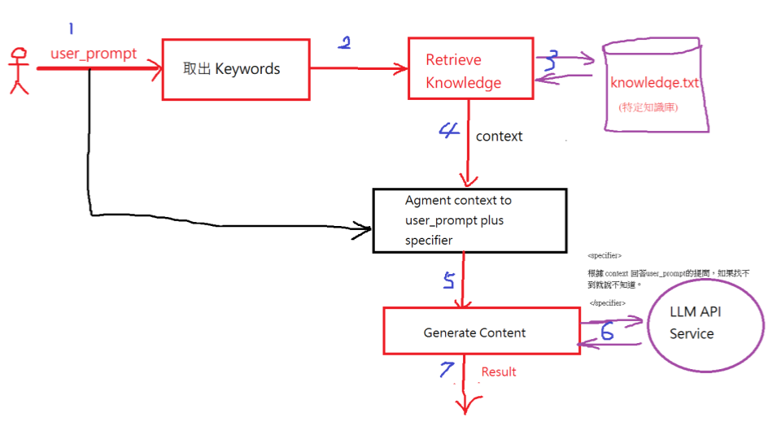

### Prompt Engineering (提示詞工程)，因為與 ```LLM``` 溝通是要講方法的。
 - ```specifer``` 是規範之意，限定 ```LLM``` 的內容生成範圍
 - ```<specifier>``` 根據 ```context``` 回答 ```user_prompt``` 的提問，如果找不到就說不知道。 ```</specifier>```
 - ```<context>```xxxxxxxxxxxxxxxx```</context>```
 - ```<user_prompt>```?????????????????```</user_prompt>```
### 在 ```Python```，要把這些打包成字串，儲存在 ```user_prompt``` 變數內
```python
user_prompt= "<user_prompt>?????????????????</user_prompt>"
user_prompt=user_prompt + "<context>xxxxxxxxxxxxxxxx</context>"
user_prompt=user_prompt+ "<specifier>根據 context 回答user_prompt的提問，如果找不到就說不知道。 </specifier>"
```
 - 然後發出 ```Request``` 到 ```LLM API Service```，它就會按照 ```specifier``` 的規範生成內容
 - ```<context>```的內容，我們要寫程式從特定資料庫取出後放進去。
### ```Application``` 有 ```2``` 種：
 1. **獨立執行**：```C:>python.exe  keyWordSearch.py```，重頭執行完就結束. 可使用 ```IDLE```、```CLI```、```Colab```
 2. **Web**：```C:>python.exe app.py``` ，一直處於執行中，```service```，等待連線。只能在 ```CLI```

### ```System Analysis & Design``` 
 - (1) 先有架構再擴充不同的單元與模組，例如 ```Python Flask Web``` 架構。
 - (2) 單元或模組都可以用 ```AI``` 生成。
 - (3) 完成 ```Testing(測試)```。
 - (4) 整合到架構內。

### File-Based RAG Application

 ```mermaid
 graph TD
    %% 定義節點樣式
    classDef userStyle fill:#fff,stroke:#333,stroke-width:1px;
    classDef processStyle fill:#fff,stroke:#ff0000,stroke-width:2px;
    classDef mainProcessStyle fill:#fff,stroke:#000000,stroke-width:2px;
    classDef dbStyle fill:#fff,stroke:#800080,stroke-width:2px;

    %% 節點定義
    User((User)):::userStyle
    ExtractKeywords[取出 Keywords]:::processStyle
    RetrieveKnowledge[Retrieve Knowledge]:::processStyle
    KnowledgeBase[(knowledge.txt <br> 特定知識庫)]:::dbStyle
    AugmentContext[Augment context to <br> user_prompt plus <br> specifier]:::mainProcessStyle
    GenerateContent[Generate Content]:::processStyle
    LLM(LLM API <br> Service):::dbStyle

    %% 流程線條與標籤
    User -- 1. user_prompt --> ExtractKeywords
    User -- 1. user_prompt --> AugmentContext
    ExtractKeywords -- 2 --> RetrieveKnowledge
    RetrieveKnowledge -- 3 --> KnowledgeBase
    KnowledgeBase -- 3 --> RetrieveKnowledge
    RetrieveKnowledge -- 4. context --> AugmentContext
    AugmentContext -- 5 --> GenerateContent
    GenerateContent -- 6 --> LLM
    LLM -- 6 --> GenerateContent
    GenerateContent -- 7. Result --> Output([Result])

    %% 備註說明
    note1[specifier: <br> 根據 context 回答 user_prompt 的提問，<br> 如果找不到就說不知道。]
    GenerateContent -.-> note1
 ```
