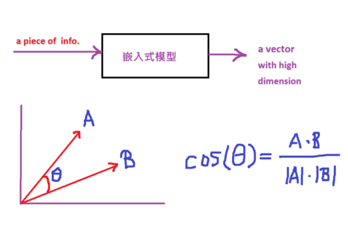
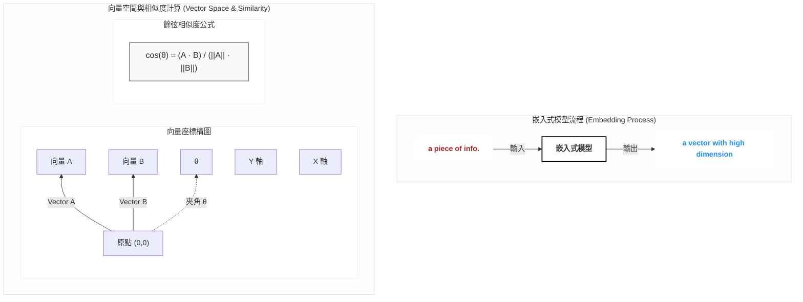
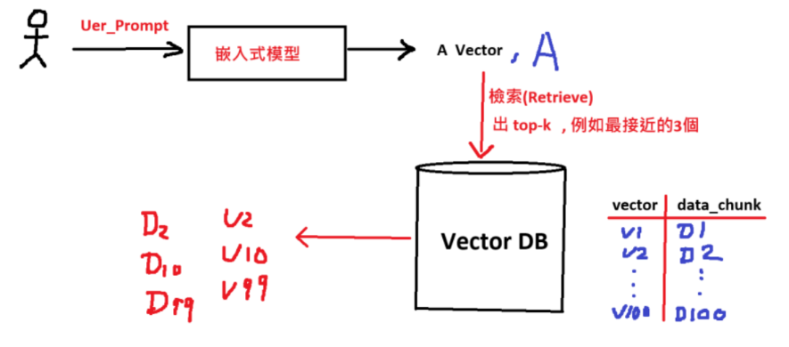
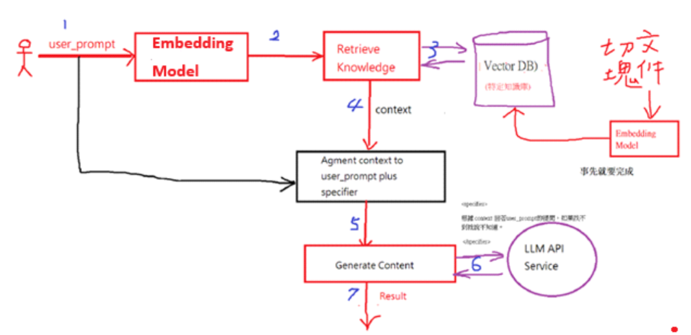

# **vector similarity**


 - **Prompt 描述**
   ```txt
   請將「圖片 vector-similarity.png」轉換為 mermaid 格式的向量座標構圖，並以 subgraph 方式保留「圖片 vector-similarity.png」layout 的樣式。
   ```
 - **Mermaid 格式**


# **vector db**


# **embedding model**
